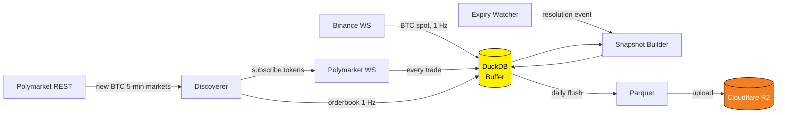

<div align="center">

# 🪙 Polymarket BTC Scraper

### Tick-level data pipeline for Polymarket's 5-minute Bitcoin binary markets

*Capture every trade, every order-book snapshot, and every BTC spot tick — in one autonomous async process.*

[](https://www.python.org/)
[](https://duckdb.org/)
[](https://parquet.apache.org/)
[](https://www.cloudflare.com/developer-platform/r2/)
[](https://www.docker.com/)
[](https://railway.app/)
[](LICENSE)
[](http://makeapullrequest.com)
[]()

[**Quick Start**](#-quick-start) · [**Architecture**](#-architecture) · [**Data Schema**](#-data-schema) · [**Deploy in 5 min**](#-deploy-to-railway-in-5-minutes) · [**Use Cases**](#-use-cases)

</div>

---

## 🎯 Why this exists

Polymarket's 5-minute BTC binary markets resolve every five minutes based on the Binance spot price — they're one of the cleanest sources of **short-horizon prediction-market microstructure** in existence. But Polymarket doesn't offer historical tick data, the WebSocket firehose is unforgiving, and order-book snapshots disappear the moment a market expires.

This repo is a **self-contained, production-grade scraper** that collects everything you need to research, backtest, and trade these markets — at sub-second resolution — for less than a coffee per month.

> Run it once. Walk away. Wake up to ML-ready Parquet files in your bucket.

---

## ✨ Features

- 🔌 **Dual WebSocket ingest** — Binance spot (`@trade` stream) + Polymarket CLOB (`market` channel), reconnect-safe
- 📡 **Auto-discovery** — finds new BTC 5-min markets the moment they're listed; no manual subscription
- 📚 **Full order-book snapshots @ 1 Hz** — every active market, both YES/NO outcomes
- 🏷️ **Expiry-aware ML labels** — every market gets a snapshot row at resolution with realized outcome
- 💾 **Hybrid storage** — hot writes to local DuckDB, cold archives as daily Parquet → Cloudflare R2
- ⚡ **Async-first** — 7 cooperating coroutines, ~200 MB RAM, ~0.05 vCPU steady state
- 🚨 **Telegram alerts** — start / stop / crash / restart, optional
- 🐳 **Single-Dockerfile deploy** — Railway, Fly, Render, or your own box
- 💸 **~$2 / month** to run end-to-end

---

## 🏗️ Architecture



Seven async tasks share a single DuckDB buffer; the writer flushes periodically, the R2 uploader ships Parquet files daily, and the expiry watcher forces an immediate flush + snapshot the moment a market resolves so no late trades are lost.

---

## 📊 Data Schema

Five tables, one Parquet file per table per day:

| Table | Source | Frequency | Purpose |
|---|---|---|---|
| `btc_spot_ticks` | Binance WS | ~1 Hz | Ground-truth BTC price; the variable each market resolves against |
| `btc_markets` | Polymarket REST | on discovery | Market metadata (question, strike, expiry, token IDs) |
| `trades` | Polymarket WS | event-driven | Every executed trade on every tracked market |
| `orderbook_ticks` | Polymarket REST | 1 Hz / market | Full L2 snapshot (YES + NO outcomes) |
| `market_snapshots` | derived | on expiry | One row per resolved market — features + outcome label |

**On disk (R2):**

```
parquet/
└── 2026-05-20/
    ├── btc_markets.parquet
    ├── btc_spot_ticks.parquet
    ├── trades.parquet
    ├── orderbook_ticks.parquet
    └── market_snapshots.parquet
```

---

## 🚀 Quick Start

### Local (Python ≥ 3.11)

```bash
git clone https://github.com/yannbellec/polymarket-btc-scraper.git
cd polymarket-btc-scraper
pip install -r requirements.txt
cp .env.example .env          # fill in R2 credentials
python main.py
```

### Docker

```bash
docker build -t pm-btc-scraper .
docker run --env-file .env pm-btc-scraper
```

That's it. Logs stream to stdout. Parquet files land in `parquet/YYYY-MM-DD/` in your R2 bucket within a few minutes.

---

## ☁️ Deploy to Railway in 5 minutes

1. **Fork** this repo.
2. New Railway project → **Deploy from GitHub repo** → select your fork.
3. Railway auto-detects the `Dockerfile`.
4. Add the environment variables from `.env.example` (see below).
5. Deploy. The first markets will be picked up within ~30 s.

### Cloudflare R2 setup

1. Cloudflare Dashboard → **R2** → Create bucket `polymarket-btc-data`
2. **Manage R2 API tokens** → Create token with *Object Read & Write*
3. Copy the **Account ID**, **Access Key**, and **Secret Key** into Railway

---

## ⚙️ Configuration

| Variable | Required | Description |
|---|---|---|
| `R2_ACCOUNT_ID` | ✅ | Cloudflare account ID |
| `R2_ACCESS_KEY_ID` | ✅ | R2 access key |
| `R2_SECRET_ACCESS_KEY` | ✅ | R2 secret key |
| `R2_BUCKET_NAME` | ✅ | Bucket name (e.g. `polymarket-btc-data`) |
| `R2_ENDPOINT_URL` | ✅ | `https://<ACCOUNT_ID>.r2.cloudflarestorage.com` |
| `TELEGRAM_BOT_TOKEN` | ⬜ | Bot token for alerts (optional) |
| `TELEGRAM_CHAT_ID` | ⬜ | Chat ID for alerts (optional) |

---

## 🔬 Use Cases

This is a **research-grade dataset**, not a trading bot. What you can build on top:

- 🧠 **Train a classifier** — predict P(resolves YES) from order-book imbalance + spot momentum on the last 30 seconds before expiry.
- 📈 **Backtest market-making** — full L2 history lets you replay quote ladders and measure realized spread.
- 🔎 **Microstructure research** — measure how prediction-market prices reprice in the milliseconds following a Binance trade.
- 💡 **Alpha discovery** — quantify mispricing windows where Polymarket lags the underlying spot.
- 📚 **Academic** — clean, time-aligned event data across two venues; great for prediction-market or efficient-market studies.

---

## 🛰️ Querying the data

Everything is plain Parquet — query it from anywhere:

```python
import duckdb

con = duckdb.connect()
df = con.execute("""
    SELECT s.market_id, s.realized_outcome, t.price, t.ts_ms
    FROM 'parquet/2026-05-20/market_snapshots.parquet' s
    JOIN 'parquet/2026-05-20/trades.parquet' t USING (market_id)
    WHERE t.ts_ms BETWEEN s.expiry_ts_ms - 30000 AND s.expiry_ts_ms
""").df()
```

DuckDB will read directly from R2 with `httpfs` if you'd rather not download.

---

## 💸 Cost

| Component | Monthly cost |
|---|---|
| Railway (200 MB RAM, ~0.05 vCPU avg.) | **~$1.50 – $2.50** |
| Cloudflare R2 (egress-free, ~5 GB / mo storage) | **~$0.08** |
| Binance + Polymarket WS | Free |
| **Total** | **< $3 / month** |

---

## 📁 Repo structure

```
polymarket-btc-scraper/
├── main.py                  # entry point — orchestrates 7 async tasks
├── scraper/
│   ├── ws_rtds.py           # Binance spot WebSocket
│   ├── ws_polymarket.py     # Polymarket CLOB WebSocket
│   ├── discoverer.py        # finds new BTC 5-min markets
│   └── snapshot_builder.py  # ML labels at expiry
├── storage/
│   ├── writer.py            # DuckDB buffer + flush loop
│   └── r2_uploader.py       # Parquet → R2
├── monitoring/
│   ├── logger.py            # structured logs (rich)
│   └── telegram_alert.py    # optional Telegram hooks
├── config/                  # constants, market filters
├── Dockerfile
├── railway.toml
└── requirements.txt
```

---

## 🗺️ Roadmap

- [ ] Real-time dashboard (Streamlit) over the live DuckDB buffer
- [ ] Pre-built Hugging Face dataset of resolved markets + labels
- [ ] Add ETH, SOL, and hourly-resolution markets
- [ ] Pluggable storage backends (S3, GCS, B2)
- [ ] Parquet schema versioning + migration helpers
- [ ] Lightweight client SDK for downstream consumers

PRs welcome — see [Contributing](#-contributing).

---

## 🤝 Contributing

Issues and PRs are very welcome. Good first contributions:

- More venues (Kalshi, Manifold)
- Better retry / circuit-breaker logic on WS reconnects
- Tests around the snapshot builder edge cases
- Documentation improvements

Run `python main.py` locally with a throwaway R2 bucket to validate changes end-to-end.

---

## ⚠️ Disclaimer

This software is provided for **research and educational purposes only**. It does not constitute financial advice. Prediction markets are regulated differently across jurisdictions — check your local laws before trading on Polymarket. The authors accept no liability for any use of the collected data.

---

## 📜 License

[MIT](LICENSE) © [yannbellec](https://github.com/yannbellec)

---

<div align="center">

### ⭐ If you find this useful, please star the repo — it helps a lot.

[](https://star-history.com/#yannbellec/polymarket-btc-scraper&Date)

</div>
